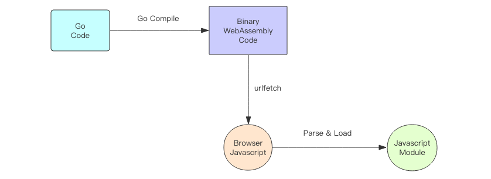

<!-- TOC -->

- [1. WebAssembly 运行原理](#1-webassembly-运行原理)
- [2. Go WebAssembly 运行原理](#2-go-webassembly-运行原理)
- [3. Go WebAssembly 初体验](#3-go-webassembly-初体验)
    - [3.1. 第一步](#31-第一步)
    - [3.2. 第二步](#32-第二步)
    - [3.3. 第三步](#33-第三步)
    - [3.4. 第四步](#34-第四步)
    - [3.5. 第五步](#35-第五步)

<!-- /TOC -->

# 1. WebAssembly 运行原理

WebAssembly 这个名字翻译过来就是 「Web 汇编」, 也就是 Web 端的汇编语言。它是一段二进制字节码程序, Javascript 可以将这段二进制程序编译成模块, 然后再实例化这个模块就可以调用字节码逻辑了。WebAssembly 代码运行的速度很快, 比 Javascript 要快很多, Javascript 可以通过 WebAssembly 技术将关键性耗费性能的逻辑交给 WebAssembly 来做就可以明显提升浏览器端的性能。

对比显示, 使用 WebAssembly 运行斐波那契数列相比使用原生 Javascript 来实现, 运行效率上能带来 3.5 倍的提升。

WebAssembly 是一项比较新的技术, 只有比较现代的浏览器才支持 WebAssembly, 例如 Chrome、FireFox 浏览器。



# 2. Go WebAssembly 运行原理

Go 编译器可以将代码编译成 WebAssembly 二进制字节码, 被浏览器以静态资源的形式加载进来后转换成 Javascript 模块。有了这个模块, 浏览器可以直接操纵 Go 语言生成的二进制字节码逻辑。同时在 Go 语言编写的代码中可以直接读写浏览器里面 Javascript 运行时对象, 这样就完成了 Javascript 和 Go 代码的双向交互。

Go 语言直到 1.11 版本之后才开启了对 WebAssembly 的支持。如需体验, 必须升级。

参考: [Go WebAssembly 官方文档](https://github.com/golang/go/wiki/WebAssembly)

# 3. Go WebAssembly 初体验

下面我们就开始体验一下 Chrome 浏览器与 Go 代码是如何交互的。我们要实现一个功能, 在浏览器的输入框里输入一个正整数, 然后调用 Go 代码的斐波那契数列, 再将结果再呈现在页面上。涉及到 4 个文件, 分别是 fib.go、main.go、index.html、wasm_exec.js。

## 3.1. 第一步

使用 Go 代码编写 WebAssembly 模块文件 fib.go, 将 Go 语言实现的斐波那契函数注册到 Javascript 全局环境。这需要使用内置的 syscall/js 模块, 它提供了和 Javascript 引擎交互的接口。

```Go
package main

import "syscall/js"

func main() {
	funFib := func(params []js.Value) {
		var n = params[0].Int()  // 输入参数
		var callback = params[1] // 回调参数
		var result = fib(n)
		// 调用回调函数, 传入计算结果
		callback.Invoke(result)
	}
	// 注册全局函数
	js.Global().Set("fib", js.NewCallback(funFib))
	// 保持 main 函数持续运行
	select {}
}

// 计算斐波那契数
func fib(n int) int {
	if n <= 0 {
		return 0
	}
	var result = make([]int, n+1)
	result[0] = 0
	result[1] = 1
	if n <= 1 {
		return result[n]
	}
	for i := 2; i <= n; i++ {
		result[i] = result[i-2] + result[i-1]
	}
	return result[n]
}
```

Go 语言注册到 Javascript 引擎的函数在执行时是异步的, 所以这个函数没有返回值, 在完成计算后需要通过调用「传进来的回调函数」将结果传递到 Javascript 引擎。注意 main 函数要保持运行状态不要退出, 不然注册进去的 fib 函数体就销毁了。

## 3.2. 第二步

下面将 Go 代码编译成 WebAssembly 二进制字节码。

```Bash
$ GOARCH=wasm GOOS=js go build -o fib.wasm fib.go
```

执行完成后可以看到目录下多了一个 fib.wasm, 这个就是字节码文件。它的大小是 1.3M, 作为静态文件传递到浏览器似乎有点大, 不过静态文件服务器一般有 gzip 压缩, 压缩后的大小只有几百 K, 这差不多也可以接受了。

## 3.3. 第三步

编写网页文件 index.html, 这个网页包含两个输入框, 第一个输入框用来输入整数参数, 第二个输入框用来呈现计算结果。当第一个输入框内容发生改变时, 调用 Javascript 代码, 执行通过 WebAssembly 注册的 fib 函数。需要传入参数 n 和回调的函数。

```html
<html>

<head>
    <meta charset="utf-8">
    <title>Go wasm</title>
</head>

<style>
body {
    text-align: center
}
input {
    height: 50px;
    font-size: 20px;
}
#result {
    margin-left: 20px;
}
</style>

<body>
    <script src="wasm_exec.js"></script>
    <script>
        // 容纳 WebAssembly 模块的容器
        var go = new Go();
        // 下载 WebAssembly 模块并执行模块
        // 也就是运行 Go 代码里面的 main 函数
        // 这样 fib 函数就注册进了 Javascript 全局环境
        WebAssembly.instantiateStreaming(fetch("fib.wasm"), go.importObject).then((result) => {
            go.run(result.instance);
        });

        function callFib() {
            let paramInput = document.getElementById("param")
            let n = parseInt(paramInput.value || "0")
            // 传入输入参数和回调函数
            // 回调函数负责呈现结果
            fib(n, function(result) {
                var resultDom = document.getElementById("result")
                resultDom.value = result
            })
        }

    </script>
    // 输入发生变化时, 调用 WebAssembly 的 fib 函数
    <input type="number" id="param" oninput="callFib()"/>
    <input type="text" id="result" />
</body>

</html>
```

注意代码中引入了一个特殊的 JS 文件 wasm_exec.js, 这个文件可以从 Go 安装目录的 misc 子目录里找到, 将它直接拷贝过来。它实现了和 WebAssembly 模块交互的功能。

## 3.4. 第四步

运行静态文件服务器, 这里不能使用普通的静态文件服务器, 因为浏览器要求请求到的 WebAssemly 字节码文件的 Content-Type 必须是 application/wasm, 很多静态文件服务器并不会因为扩展名是 wasm 就会自动使用这个 Content-Type。但是 Go 内置的 HTTP 服务器可以。所以下面我们使用 Go 代码简单编写一个静态文件服务器。

```Go
package main

import (
	"log"
	"net/http"
)

func main() {
	mux := http.NewServeMux()
	mux.Handle("/", http.FileServer(http.Dir(".")))
	log.Fatal(http.ListenAndServe(":8000", mux))
}
```

使用下面的命令运行它: 

```Bash
$ go run main.go
```

## 3.5. 第五步

打开浏览器, 访问 http://localhost:8000, 现在就可以体验它的运行效果了。
